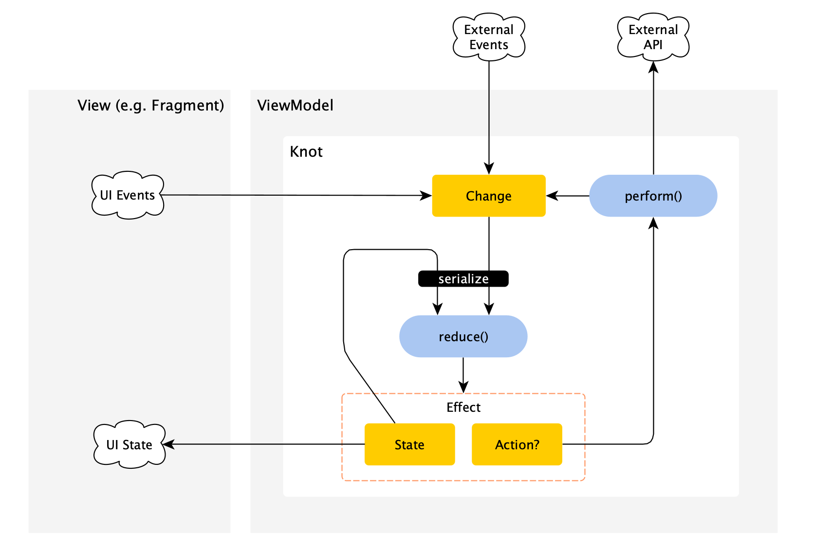
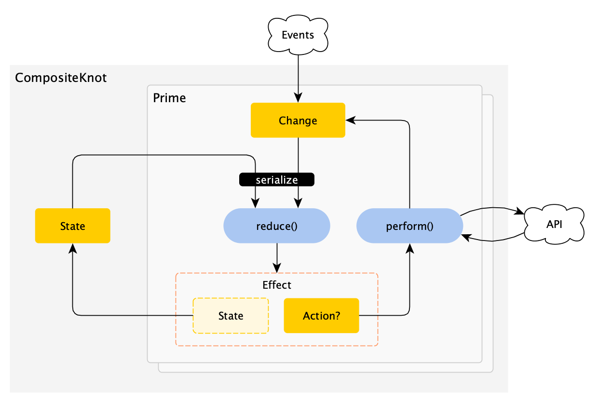

[](http://search.maven.org/#search%7Cga%7C1%7Cg%3A%22de.halfbit%22%20a%3A%22knot%22)

[](https://travis-ci.org/beworker/knot)
[](https://codecov.io/gh/beworker/knot)
[](http://www.apache.org/licenses/LICENSE-2.0)

# 🧶 Knot

Concise reactive state container library for Android applications.

# Concept

Knot helps managing application state by reacting on events and performing asynchronous actions in a structured way. There are five core concepts Knot defines: `State`, `Change`, `Action`, `Reducer` and `Effect`.



`State` represents an immutable partial state of an application. It can be a state of a screen or a state of an internal headless component, like a repository.

`Change` is an immutable data object with an optional payload intended for changing the `State`. A `Change` can be produced from an external source or be a result of execution of an `Action`.

`Action` is a synchronous or an asynchronous operation which, when completed, can – but doesn't have to – emit a new `Change`.

`Reducer` is a function that takes the previous `State` and a `Change` as arguments and returns the new `State` and an optional `Action` wrapped by the `Effect` class. `Reducer` in Knot is designed to stay side-effects free because each side-effect can be turned into an `Action` and returned from the reducer function together with a new state in a pure way.

`Effect` is a convenient wrapper class containing the new `State` and an optional `Action`. If `Action` is present, Knot will perform it and provide resulting `Change` (if any) back to the `Reducer`.

In addition to that each Knot can subscribe to `Events` coming from external sources and turn them into `Changes` for further processing.

# Unique Features

* **DSL**. Knot provides a concise and easy to understand DLS for writing state container logic.
* **External events**. Knot can mix external events like "user location updates", "database table changes", "network state" etc. into the loop by design. All events go through the reducer first, to be processed in accordance with the current state. Thus the state handling is well synchronized and is localized at a single place - in the reducer.
* **Actions as side-effects**. Common unanswered question of many state containers is how to handle side-effects in reducer, when the state does not reflect the change but the app, for instance, has to show a message to the user instead. Knot answers this by allowing to issue an `Action` from the reducer, which then can be processed outside. This keeps reducer a pure function and provides a structured way of handling side-effects.
* **Decomposition**. Knot offers a convenient and structured way of splitting code into multiple parts when the code becomes complex.

# Getting Started

The example below declares a Knot capable of loading data, handling *Success* and *Failure* loading results and reloading data automatically when an external *"data changed"* signal gets received. It also logs all `State` mutations as well as all processed `Changes` and `Actions` in console.

```kotlin
sealed class State {
   object Empty : State()
   object Loading : State()
   data class Content(val data: String) : State()
   data class Failed(val error: Throwable) : State()
}

sealed class Change {
   object Load : Change() {
      data class Success(val data: String) : Change()
      data class Failure(val error: Throwable) : Change()
   }
}

sealed class Action {
   object Load : Action()
}

val knot = knot<State, Change, Action> {
    state { 
        initial = State.Empty 
        watchAll { println("state: $it") }
    }
    changes {
        reduce { change ->
            when (change) {
                is Change.Load -> State.Loading + Action.Load
                is Change.Load.Success -> State.Content(data).only
                is Change.Load.Failure -> State.Failed(error).only
            }
        }
        watchAll { println("change: $it") }
    }
    actions {
        perform<Action.Load> {
            switchMapSingle<String> { api.load() }
                .map<Change> { Change.Load.Success(it) }
                .onErrorReturn { Change.Load.Failure(it) }
        }
        watchAll { println("action: $it") }
    }
    events {
        source {
            dataChangeObserver.signal.map { Change.Load }
        }
    }
}

val states = knot.state.test()
knot.change.accept(Change.Load)

states.assertValues(
    State.Loading,
    State.Content("data")
)
```

Notice how inside the `reduce` function a new `State` can be combined with an `Action` using `+` operator. If only the `State` value should be returned from the reducer, the `.only` suffix is added to the `State`.

Checkout [Co2Monitor sample app](https://github.com/beworker/co2monitor/blob/master/android-client/main-dashboard/src/main/java/de/halfbit/co2monitor/main/dashboard/DashboardViewModel.kt) for more details.

# Decomposition

If your knot becomes complex and you want to improve its readability and maintainability, you may consider to decompose it. You start decomposition by grouping related functionality into, in a certain sense, indecomposable pieces called `Primes`. 



Each `Prime` is isolated from the other `Primes`. It defines its own set of `Changes`, `Actions` and `Reducers`. It's only the `State`, what is shared between the `Primes`. In that respect each `Prime` can be seen as a separate `Knot` working on a shared `State`. Once all `Primes` are defined, they can be composed together and provided to `CompositeKnot` which implements standard `Knot` interface. For more information check out [PrimeTest](https://github.com/beworker/knot/blob/master/knot/src/test/kotlin/de/halfbit/knot/PrimeTest.kt) class.

# Why Knot?

* Predictable - state is the single source of truth.
* Side-effect free reducer - by design.
* Scalable - single knots can be combined together to build more complex application logic.
* Decomposable - complex knots can be decomposed into primes by related functionality.
* Structured - easy to read and write DSL for writing better structured and less buggy code.
* Concise - it has minimalistic API and compact implementation.
* Testable - reducers and transformers are easy to test.
* Production ready - Knot is used in production.
* Why not?

# Download
```kotlin
repositories {
    mavenCentral()
}
dependencies {
    implementation 'de.halfbit:knot:<version>'
}
```

# Inspiration
Knot was inspired by two awesome projects
* Krate https://github.com/gustavkarlsson/krate
* Redux-loop https://github.com/redux-loop/redux-loop

# License
```
Copyright 2019 Sergej Shafarenka, www.halfbit.de

Licensed under the Apache License, Version 2.0 (the "License");
you may not use this file except in compliance with the License.
You may obtain a copy of the License at

   http://www.apache.org/licenses/LICENSE-2.0

Unless required by applicable law or agreed to in writing, software
distributed under the License is distributed on an "AS IS" BASIS,
WITHOUT WARRANTIES OR CONDITIONS OF ANY KIND, either express or implied.
See the License for the specific language governing permissions and
limitations under the License.
```
