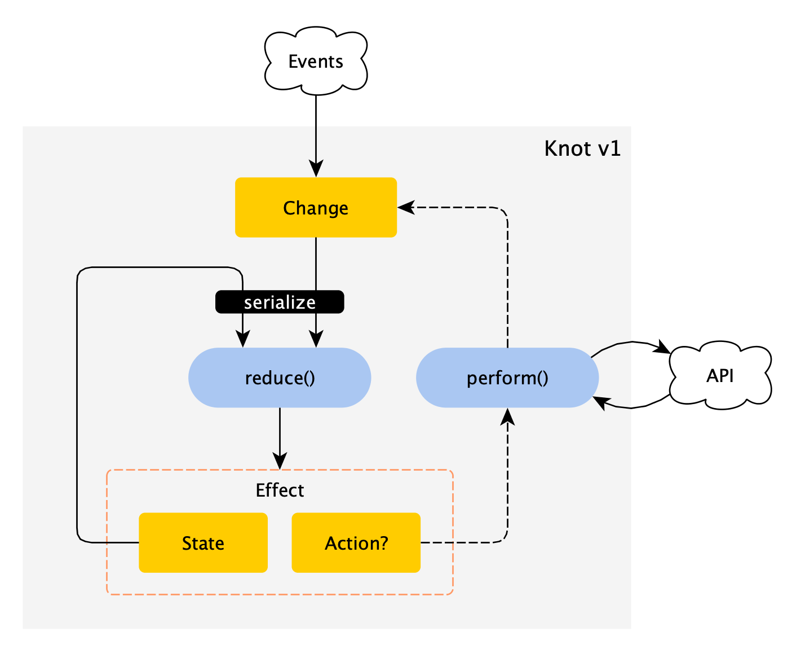

[](http://search.maven.org/#search%7Cga%7C1%7Cg%3A%22de.halfbit%22%20a%3A%22knot%22)
[](http://www.apache.org/licenses/LICENSE-2.0)

# Knot

Lightweight reactive state container library for Android applications.

# Concept

Knot helps managing application state, external events and asynchronous actions. It defines five core concepts for achiving this: `State`, `Change`, `Reducer`, `Effect` and `Action`.



`State` represents an immutable partian state of an Android application. It can be a state of a screen or a state of an internal headless component.

`Change` is an immutable data object with an optional payload intended for changing the `State`. A `Change` can be produced from an external event or be a result of execution of an `Action`.

`Action` is a reactive single value respose which, when it gets completed, emits a new `Change`. 

`Reducer` is a function that takes the previous `State` and a `Change` as arguments and returns an `Effect`. `Effect` is a convenience wrapper class similar to `Pair` class. If contains a new `State` and an optional `Action` which, when present, will be executed.

# License
```
Copyright 2019 Sergej Shafarenka, www.halfbit.de

Licensed under the Apache License, Version 2.0 (the "License");
you may not use this file except in compliance with the License.
You may obtain a copy of the License at

   http://www.apache.org/licenses/LICENSE-2.0

Unless required by applicable law or agreed to in writing, software
distributed under the License is distributed on an "AS IS" BASIS,
WITHOUT WARRANTIES OR CONDITIONS OF ANY KIND, either express or implied.
See the License for the specific language governing permissions and
limitations under the License.
```
